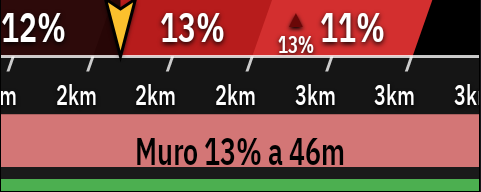

<p align="center">
  
</p>
# ALTGRAPH (v1.0.40 ELITE)
<p>Leer en: <a href="https://github.com/DAVOE75/ALTGRAPH/blob/main/README.md">🇪🇸 Español</a> | <a href="https://github.com/DAVOE75/ALTGRAPH/blob/main/README_en.md">🇬🇧 English</a> | <a href="https://github.com/DAVOE75/ALTGRAPH/blob/main/README_fr.md">🇫🇷 Français</a> | <a href="https://github.com/DAVOE75/ALTGRAPH/blob/main/README_it.md">🇮🇹 Italiano</a> | <a href="https://github.com/DAVOE75/ALTGRAPH/blob/main/README_de.md">🇩🇪 Deutsch</a> | <a href="https://github.com/DAVOE75/ALTGRAPH/blob/main/README_pt.md">🇵🇹 Português</a></p>

**ALTGRAPH** es una extensión de rendimiento y altimetría profesional de última generación para ciclocomputadores **Hammerhead Karoo** (Karoo 2 y Karoo 3) desarrollada por **David García Pascual** utilizando el SDK oficial `karoo-ext`.
Revoluciona el concepto tradicional de altimetría ciclista incorporando una **Suite de 6 Modelos de Visualización Altimétrica** con selector dinámico en vivo, escala monocromática continua de 15 tramos, avance cuántico en ventana rodante de 50 metros, resolución adaptativa multiescala, análisis de puertos de montaña, cálculo topográfico opcional (proyección horizontal pura), detección matemática de curvas de herradura (tornanti), filtrado por categorías de Hitos (Pueblos, Fuentes, Miradores, Cimas), conmutador de escala de zoom al tocar la pantalla, tipografías Google Sans / Condensed, modo apaisado rotado a 90° a pantalla completa, ritmo **VAM** dual con velocidad recomendada y cálculo científico del **Grado de Fatiga (GF)**.

<p align="center">
  
</p

## 🚀 ACTUALIZACIÓN MASIVA (v1.0.10 - v1.0.40): ESTABILIDAD, RESOLUCIÓN Y PRECISIÓN 🚀

Esta serie de actualizaciones se ha centrado en pulir el motor interno de seguimiento de rutas y dar más control al usuario Elite:

- **Resolución de Radar Personalizable (Novedad ELITE)**: Se ha añadido un nuevo menú desplegable para forzar la resolución del Radar Altimétrico a gusto del usuario. En lugar de usar la escala "Auto" adaptativa al zoom, ahora puedes obligar al radar a diseccionar el terreno cada **20m, 50m, 100m, 150m, 300m, 500m o 1km**. Ideal para no perderse ninguna micro-rampa en falsos llanos.
- **Motor de Tracking Blindado (Adiós a los saltos al km0)**: Se ha reescrito por completo el algoritmo de seguimiento GPS sobre el polyline. Se acabaron los molestos reinicios a 0 metros y la suma ilógica de distancias cuando el Karoo recalcula una ruta, recorta el polyline por un puerto (Climb Detect), o cuando recargas manualmente un track a mitad de trayecto. Ahora el anclaje a tu coordenada real es matemático y milimétrico.
- **Corrección Gráfica del Radar (Black gap fix)**: Solucionado un defecto visual en el cálculo dinámico de la anchura de los bloques de pendiente que causaba que el radar no llegara hasta el borde izquierdo de la pantalla dejando un hueco negro. 
- **Nuevo Icono y Limpieza Visual**: Rediseño del icono oficial de la extensión de Karoo por un escudo minimalista mucho más integrado con la interfaz del sistema.
- **Traducciones Nativas Perfectas**: Revisión de la codificación UTF-8 y despliegue del 100% de los nuevos textos en Español, Inglés, Francés, Alemán, Italiano y Portugués.
- **OTA Updates (Auto-Actualizador)**: Mejoras internas en el sistema de auto-actualización del Karoo y corrección de firmas duplicadas que impedían instalar algunas versiones previas.

## 🚀 VERSIÓN 1.0.9: HISTOGRAMA DE ZONAS ELITE 🚀

- **NUEVA FUNCIÓN ELITE (v1.0.9) - Zonas de Dureza (Histograma %)**: ¡Nuevo campo de datos visual! Analiza tu ruta en tiempo real viendo exactamente qué porcentaje de distancia y tiempo (absoluto) has pasado en cada una de las 8 franjas de pendiente (desde Bajada hasta Extrema >17%). Incluye colores 100% integrados con el Radar Altimétrico, tamaño dinámico de texto y se activa automáticamente con tu clave de Suscripción Elite.

<p align="center"></p>

## 🚀 VERSIÓN 1.0.6: CORRECCIÓN DE INSTALACIÓN Y MEJORAS 3D 🚀

- **Rendimiento 3D y fluidez**: Solucionado un problema severo de agotamiento de memoria y bloqueos en el dispositivo (*Garbage Collection thrashing*). Los modelos de altimetría tridimensional y picos topográficos han sido optimizados, lo que resulta en un rendimiento gráfico extremadamente fluido y un menor consumo de batería.
- **Fallo de firmas y Auto-actualización**: Corregido el error de instalación (`INSTALL_PARSE_FAILED_NO_CERTIFICATES`) provocado por la ausencia de certificados en el APK. Ahora las descargas manuales y las auto-actualizaciones directas desde el Karoo se instalan sin problemas.


## 🌟 VERSIÓN 1.0.5: ESCALA DINÁMICA Y AVISOS OPCIONALES 🌟

- **NUEVA FUNCIÓN ELITE - Avisos Dinámicos Opcionales**: Ahora puedes activar o desactivar los avisos dinámicos de ("Muro", "Próximo Puerto", "Metros para Coronar") desde la pestaña ELITE en la configuración de la app. Al desactivarlos, el radar altimétrico 3D se expandirá automáticamente para ocupar todo el espacio disponible, ¡ofreciendo un área de visión mucho mayor!
- **Ajuste de Escala Dinámica en Campos Múltiples**: Hemos reprogramado la lógica visual de la escala kilométrica inferior. Los textos (0m, 50m, 1km...) ahora calculan el espacio de forma inteligente. Esto arregla un problema visual donde los números se cortaban al usar el radar en pantallas con múltiples campos de datos divididos.
- **Calibración Genuina de GPS**: El progreso del radar de Altimetría ahora está matemáticamente anclado al avance real del GPS de tu Karoo (y no únicamente a la línea de ruta teórica), solucionando problemas de desfase en rutas muy largas.
- **Lógica de renderizado**: Solucionado un solapamiento gráfico que ocurría al ocultar la barra de avisos dinámicos en vistas apaisadas.

> [!NOTE]
> **Ruta de Mapa Coloreada por Gradiente (Match Perfecto)**: La línea de ruta dibujada sobre el mapa topográfico ahora se pinta de colores en tiempo real indicando la dureza de la pendiente. Usa exactamente la misma escala matemática rigurosa que el Radar Altimétrico, permitiendo que ambos coincidan milimétricamente. Además, hemos diseñado el trazado para sobreponerse perfectamente a la línea nativa del Karoo.

| 🗺️ Ruta Completa Coloreada | 🗺️ Detalle de Tramos Duros | 🗺️ Vista de Puerto Individual |
| :---: | :---: | :---: |
|  |  |  |


## 🐛 VERSIÓN 1.0.4: PRECISIÓN GPS MILIMÉTRICA 🐛

- **Corrección Crítica de Sincronización GPS (Corner Cutting Fix)**: Se ha reescrito por completo el motor matemático de cálculo de distancias para incorporar un *Calibrador Escalar Dinámico*. A partir de ahora, las distancias matemáticas simplificadas de la ruta se estiran y adaptan milimétricamente a las distancias reales reportadas por la telemetría del Karoo sobre el asfalto. Tu avance en el radar y el perfil coinciden a la perfección con la realidad, mostrando los porcentajes verdaderos justo bajo tu rueda desde el kilómetro cero hasta el final de la ruta.
- **Reparación del Desfase de Puntero (X-Axis)**: Solucionados todos los problemas de compresión del eje X que causaban que la pantalla te advirtiera de muros o descansos con retraso.
- **Actualización del Motor de Renderizado**: Optimización de la generación de las Curvas de Herradura dinámicas en tiempo real.

## 🐛 VERSIÓN 1.0.3: CORRECCIÓN DE DISTANCIA Y RUTA 🐛

- **Corrección del Radar Altimétrico:** Se ha solucionado un error crítico que provocaba que el radar y el marcador de progreso del ciclista volvieran erróneamente al kilómetro 0 (km 0) al iniciar un puerto o tras recorrer varios kilómetros.
- **Progreso de ruta continuo:** Ahora la aplicación compensa correctamente los recortes internos de la ruta (polyline) que hace el GPS Karoo. La distancia recorrida, la barra inferior y los avisos mantendrán su progreso global continuo a lo largo de todo tu recorrido.

## 🐛 VERSIÓN 1.0.2: CORRECCIONES CRÍTICAS 🐛

- **Corrección de Bug en Rutas Circulares/Ida y Vuelta**: Solucionado un problema donde el GPS se anclaba erróneamente al final de la ruta al inicio de la misma, haciendo que la gráfica avanzara en retroceso ("snap-to-end bug").
- **Mejora en la Interfaz (Radar)**: El indicador de pendiente máxima ahora muestra una flecha de color (Roja para ascenso, Azul Oscuro para descenso) sobre el porcentaje de desnivel, mejorando su visibilidad y estilo.

## 🚀 NOVEDADES VERSIÓN 1.0.0: RADAR ALTIMÉTRICO Y EXPERIENCIA PRO 🚀

¡Hemos alcanzado la versión **1.0.0**! Esta actualización trae un rediseño completo de la experiencia, haciendo que el control y la visualización sean más precisos y profesionales que nunca.

### 🌟 Radar Altimétrico (Nuevo Modo de Vista 3D)
El nuevo modo **Radar Altimétrico** se superpone a tu mapa de Karoo permitiendo ver tanto la navegación pura como el relieve de lo que tienes por delante, todo integrado de manera exquisita en la misma pantalla.
<p align="center">
  
</p>

### 🔧 Nuevas Funcionalidades y Mejoras:
- **Barra de Zonas de Entrenamiento**: Integración completa de la barra inferior de colores (7 zonas) basada en tus datos de potenciómetro o frecuencia cardíaca en el modo Radar Altimétrico.
- **Control Fino de Zoom (+ / -)**: Sustitución de la antigua lupa por botones dedicados de **[+]** y **[-]**. Ahora puedes bajar la escala **hasta bloques de 50 metros** saltándote el algoritmo de "Zoom Inteligente" si deseas control manual absoluto.
- **Desplazamiento Horizontal (< / >)**: Nuevos botones interactivos en la vista del perfil que permiten arrastrar (panear) la gráfica libremente a izquierda y derecha sin alterar la escala. ¡Anticípate a la subida!
- **Modo Apaisado (Landscape) Nativo**: Soporte total para Karoo montado en horizontal. Ahora los botones táctiles y el perfil se re-orientan perfectamente de acuerdo a tu campo visual, situando los controles táctiles de forma ergonómica en los bordes de la pantalla.
- **Icono del Ciclista en Tiempo Real**: La bola (posición actual del ciclista) ahora avanza fluidamente a través del perfil gráfico y de los colores de desnivel, dándote un feedback inmediato de dónde estás en la ruta.
- **Brújula Dinámica**: Ocultación inteligente de la brújula en las vistas que no son de Mapa Isométrico Global, limpiando la interfaz para mostrar solo lo relevante.

## 📸 Capturas en Pantalla Real de Karoo 3

| 🎨 Pestaña Estilo | 🎛️ Menú de Selección | 📊 Dashboard Completo |
| :---: | :---: | :---: |
|  |  |  |

| 🏔️ Altimetría 3D (200m) | 🏔️ Altimetría 3D (1km) | 🏔️ Altimetría 3D (10km) |
| :---: | :---: | :---: |
|  |  |  |

- **Ajustes Independientes (v0.7.0)**: Ahora puedes configurar de forma separada el estilo 3D (Clásico, Isométrico, etc.) para la Gráfica Global y para el Visor de Puertos desde los ajustes.
- **Rotación de Pantalla (v0.7.0)**: Ajusta el modo apaisado (Girar 90°) de manera separada para la gráfica global y el visor de puertos.

| 🏔️ Altimetría 3D (20km) | 🏔️ Altimetría 3D (200km) | 🏔️ Visor de Puertos - 3ª Cat |
| :---: | :---: | :---: |
|  |  |  |

| 🏔️ Visor de Puertos - Especial C.E. | 🏔️ Visor de Puertos (Isométrico) | 🗺️ GPS Isométrico (Global) |
| :---: | :---: | :---: |
|  |  |  |

---
## 🌐 Portal Web Oficial y Soporte Multilingüe (6 Idiomas)
Visita el **[Portal Web Oficial de ALTGRAPH (davoe75.github.io/ALTGRAPH)](https://davoe75.github.io/ALTGRAPH/)** para la documentación interactiva en español, inglés, francés, italiano, alemán y portugués.

## 👑 ALTGRAPH ELITE 👑 (v0.7.0)
- **Strava Live Segments 3D (Beta):** Simulación en vivo (KOM Ghost) en puertos de alta dureza.
- **Wind & Weather Overlay:** Integración nativa (Open-Meteo) para representar dirección del viento en vivo mediante vectores 3D (Headwind/Tailwind).
## 🚀 Novedades
- **NUEVA FUNCIÓN ELITE (v1.0.9) - Zonas de Dureza (Histograma %)**: ¡Nuevo campo de datos visual! Analiza tu ruta en tiempo real viendo exactamente qué porcentaje de distancia y tiempo (absoluto) has pasado en cada una de las 8 franjas de pendiente (desde Bajada hasta Extrema >17%). Incluye colores 100% integrados con el Radar Altimétrico, tamaño dinámico de texto y se activa automáticamente con tu clave de Suscripción Elite.
 y Funciones Destacadas (v0.7.0 ELITE)
### 🏔️ Visor de Puertos de Montaña (NUEVO en v0.4.5+)
La funcionalidad más demandada por la comunidad ciclista. Un **campo de datos a pantalla completa** dedicado exclusivamente a la visualización integral de los puertos de montaña detectados automáticamente en tu ruta cargada:
- **Navegación por puertos**: Flechas `<` y `>` para explorar todos los puertos de la ruta antes de salir o durante la marcha.
- **Información de cada puerto**: Longitud exacta, desnivel acumulado, kilómetros restantes hasta el inicio y categoría oficial.
- **Categorización estilo La Vuelta a España**: Motor APM propio que calcula y asigna categoría **3ª, 2ª, 1ª Cat o Especial C.E.** con los mismos criterios que los grandes corredores de ciclismo profesional.
- **Perfil altimétrico 3D del puerto**: Visualización completa del perfil de cada puerto con el estilo gráfico 3D de ALTGRAPH.
- **Cotas topográficas de los tres picos más altos**: Detecta automáticamente los 3 puntos más elevados del recorrido y los marca con un triángulo y cota en metros.
- **Líneas verticales de kilómetros destacadas**: Las líneas que corresponden a los kilómetros enteros en el eje X se representan más gruesas y oscuras que las divisiones de sub-bloque.
- **Leyenda de escala inferior**: Dos líneas de información debajo de la gráfica indican en todo momento `Cada bloque = Xkm` y `Cada sub-bloque = Xm` para contextualizar la escala visual.
- **Baliza del ciclista inteligente**: La bola luminosa del ciclista solo aparece sobre la gráfica del puerto cuando el ciclista llega físicamente al kilómetro de inicio del puerto. Antes, la pantalla muestra el perfil completo limpio.
- **Botones de zoom `+` y `−`** (posición ajustada para no solaparse con las cotas del eje Y).
- **Texto del eje X más grande**: Etiquetas de distancia kilométrica más legibles.
- **Internacionalización completa**: Todos los textos disponibles en 🇪🇸 Español, 🇬🇧 English, 🇫🇷 Français, 🇮🇹 Italiano y 🇩🇪 Deutsch.
### 🌟 Suite de 6 Modelos de Altimetría Revolucionarios (Conmutables al vuelo)
Permite al ciclista elegir entre 6 formas visuales de interpretar la montaña desde la tarjeta superior de la pestaña **🎨 Estilo** de la extensión:
1. **🏔️ Clásica 3D (Por defecto)**: Perfil profesional con bisel 3D sutil y estilizado, degradado monocromático suave del 0 al 15%, cotas de altitud rotadas y cápsulas oscuras de alto contraste con tipografía nítida para porcentajes.
2. **🌅 Horizonte Isométrico (`Horizonte Iso`)**: Perspectiva de cabina (*cockpit 3D*) proyectada en profundidad hacia el horizonte, carril central discontinuo tipo pista de despegue y **haz de luz frontal dinámico** proyectado por la baliza del ciclista que se inclina según la pendiente física de la rampa inminente.
3. **❄️ Oasis y Crisoles Tácticos (`Oasis Tácticos`)**: Detección inteligente de descansillos de recuperación ($\le 3\%$ y $\ge 30\text{m}$) iluminados en azul hielo con insignias dinámicas `❄️ OASIS [distancia]m`, crisoles de fuego para rampas críticas ($\ge 12\%$) con insignias tácticas `🔥 MURO [distancia]m`, y bruma atmosférica de hipoxia a altitudes $\ge 1400\text{m}$.
4. **⚡ Campo de Fuerza y Fatiga (`Campo Fuerza`)**: Relieve con líneas gravitatorias de tensión ancladas con precisión de píxel a la pendiente, onda cinética senoidal en la base (cian en avance con inercia, carmesí rápido cuando la pendiente frena la cadencia) y línea guía de ritmo ascensional (VAM) flotando suavemente sobre el perfil.
5. **💎 Monolito de Obsidiana y Plasma (`Monolito`)**: Montaña esculpida en cristal de obsidiana facetado oscuro (`#151D2C` a `#04070D`), faceta superior 3D en cristal pulido, núcleo interior de plasma radiante y cresta superior en haz láser blanco con resplandor neón celeste.
6. **🗺️ Mapa Isométrico Global (`GPS Real`)**: El motor intercepta los datos de Latitud y Longitud nativos de tu ruta `.fit` o GPX y dibuja la montaña sobre una cuadrícula isométrica real imitando a vista de pájaro el trazado topográfico físico de la carretera (con sus curvas y herraduras exactas).
### 🎨 Escala de Gradientes Intensa de Alta Visibilidad
* **$\le -10.0\%$**: Azul marino oscuro `` (Descenso pronunciado).
* **$-10.0\%$ a $-5.0\%$**: Azul oscuro `` (Descenso medio).
* **$-5.0\%$ a $-2.0\%$**: Azul medio `` (Descenso suave).
* **$-2.0\%$ a $<0.0\%$**: Azul claro celeste `` (Falso llano bajada).
* **$0.0\%$ a $3.0\%$**: Verde bosque intenso ``.
* **$3.0\%$ a $5.0\%$**: Amarillo fuerte ``.
* **$5.0\%$ a $8.0\%$**: Naranja intenso ``.
* **$8.0\%$ a $10.0\%$**: Naranja oscuro / teja ``.
* **$10.0\%$ a $13.0\%$**: Rojo intenso ``.
* **$13.0\%$ a $17.0\%$**: Granate rojo oscuro ``.
* **$> 17.0\%$**: Negro azabache ``.
### 🔄 Ventana Rodante Cuántica de 50m y Avance Físico
* El faro del ciclista asciende físicamente por el contorno superior de la pendiente de 0 a 50m.
* Al completar cada múltiplo de 50 metros, la ventana se desplaza limpiamente 50m a la izquierda sin saltos abruptos de escala.
### 📏 Resolución Adaptativa Multiescala
* $\le 500\text{m}$: Sub-bloques de **50m** dentro de bloques de 100m.
* $500\text{m}$ a $5\text{km}$: Bloques de **100m** (bloques mayores de 500m).
* $5\text{km}$ a $20\text{km}$: Bloques de **500m** (bloques mayores de 2km).
* $20\text{km}$ a $50\text{km}$: Bloques de **1km** (bloques mayores de 5km).
* $> 100\text{km}$: Tramos de **10km** (bloques mayores de 20km).
### ⚡ Arquitectura Zero-Allocation para Karoo 3
* Canvas de renderizado sin asignación de memoria: cero pausas del recolector de basura (GC) en segundo plano.
* Reutilización de búfer `Bitmap` y `Canvas` en tiempo real.
### 📊 Encabezado Triple y Telemetría
* Lectura en vivo de **PENDIENTE ACTUAL**, **PENDIENTE MEDIA** del tramo visible y **PENDIENTE MÁXIMA**.
* Detección vectorial de curvas de herradura (tornanti), filtro de hitos POIs (Pueblos, Fuentes, Miradores, Cimas), método topográfico exacto, ritmo VAM objetivo e Índice Grado de Fatiga (GF).

## 🆚 ALTGRAPH vs Climber Nativo de Karoo
ALTGRAPH no sustituye el Climber nativo, sino que lo complementa ofreciendo una **vista gráfica integral** y personalizable como un campo de datos (`Data Field`) o a pantalla completa. Sus principales diferencias son:
- **Resolución Adaptativa y Renderizado Continuo**: El perfil avanza físicamente en ventanas rodantes de 50m. Las barras no pegan "saltos" estáticos, fluyen hacia ti con la cadencia de tu pedaleo.
- **Modelos de Visualización**: El nativo tiene una vista fija; ALTGRAPH te ofrece 5 modelos revolucionarios (Clásica 3D, Horizonte Isométrico, Oasis Tácticos, Campo de Fuerza y Monolito).
- **Escalas Dinámicas al Toque**: Puedes cambiar instantáneamente el zoom de la ruta (200m, 1km, 10km, 20km, 50km, etc.) simplemente tocando el botón de lupa sin salir de tu entrenamiento.
- **Grado de Fatiga (GF)**: Única herramienta en Karoo que calcula la dureza científica de un puerto basándose en el coeficiente APM (Altimetrías de Puertos de Montaña).
- **Visor de Puertos de Montaña**: Campo dedicado con perfil completo de cada puerto, categorización estilo La Vuelta y leyenda de escala dinámica.

## ⚙️ Características y Funciones en Detalle
### 📈 Campos de Datos Exclusivos (Dashboard Táctico)
Además del motor gráfico, ALTGRAPH expone métricas avanzadas como campos individuales para que diseñes tu pantalla perfecta:
- **🧠 Estratega de Altimetría**: Muestra un bloque visual inteligente con el resumen de los próximos kilómetros. Divide el horizonte en tramos de color para que sepas de un vistazo rápido si lo que viene es puerto duro (rojo), descanso (verde) o terreno rompepiernas.
- **🏔️ Visor de Puertos 3D**: Explora de forma independiente cada puerto de montaña detectado en tu ruta. Se renderiza a pantalla completa con navegación táctil, mostrando longitud, desnivel, kilómetros restantes, pendiente media y máxima, y categorización oficial tipo **La Vuelta a España** (3ª, 2ª, 1ª Cat o Especial C.E.) calculada matemáticamente. Incluye perfil 3D completo con cotas topográficas, leyenda de escala y baliza del ciclista inteligente.
- **⚡ Grado de Fatiga (GF)**: Motor científico basado en el coeficiente APM que evalúa la dureza real del puerto en vivo, mostrándote un coeficiente numérico de desgaste.
- **🚀 Ritmo VAM Objetivo**: Define tu VAM (Velocidad Ascensional Media) ideal en la configuración. Este campo calcula la pendiente exacta bajo tus ruedas y te dicta a qué **velocidad (km/h)** debes rodar en ese instante para cumplir tu objetivo en la cima.
- **📐 Tendencia 3D y Rampa Máxima**: Te avisa de si la pendiente se está endureciendo o suavizando antes de que tus piernas lo noten.
### 🗺️ Navegación y Topografía Avanzada
- **Iconos Topográficos Oficiales**: Identificación de Cimas, Puertos de Montaña (Map-Pin), Pueblos y Fuentes extraídos directamente de la ruta o del relieve.
- **Detección Matemática de Curvas**: El algoritmo detecta giros cerrados (tornanti/herraduras) y te avisa gráficamente.
- **Cálculo Topográfico Puro**: Opcionalmente, puedes calcular las distancias en base a proyección horizontal para un rigor absoluto en puertos extremos de alta montaña.
- **Temas Oscuros y de Alto Contraste**: Interfaz diseñada para una legibilidad instantánea bajo el sol directo o con gafas fotocromáticas.

## 📲 Instalación en Karoo 2 y Karoo 3
Al estar basada en el SDK oficial `karoo-ext`, la instalación **no requiere root** ni modificaciones peligrosas del sistema operativo. Es 100% segura.
**Vía Sideloading (Recomendado para Karoo 3)**
1. Descarga el archivo `.apk` de la última versión desde la sección [Releases](https://github.com/DAVOE75/ALTGRAPH/releases).
2. Envíalo a tu Karoo usando la app oficial **Hammerhead Companion** en tu smartphone.
3. Una vez instalada, la extensión ALTGRAPH buscará actualizaciones futuras de manera automática leyendo el `manifest.json`.
**Vía ADB (Avanzado)**
1. Habilita las Opciones de Desarrollador y la depuración USB en tu dispositivo Karoo.
2. Conecta el dispositivo al PC y ejecuta: `adb install -r altgraph.apk`

## 🔧 Configuración Inicial
Para dar vida a ALTGRAPH en tu pantalla de entrenamiento:
1. En tu Karoo, ve a **Profiles** (Perfiles de usuario) y edita tu perfil habitual (ej: Carretera o MTB).
2. Edita una de las páginas de datos y selecciona la disposición (layout) que prefieras (soporta desde el bloque gráfico central hasta pantalla completa 100%).
3. Toca la celda para elegir el campo, baja a la sección de extensiones y elige **ALTGRAPH**.
4. ¡Opcional!: Abre la app compañera de ALTGRAPH desde el cajón principal de apps (App Launcher) para ajustar tus preferencias, como el modelo 3D por defecto o tu VAM objetivo.

## 🧠 Arquitectura y Cómo Funciona
- **Integración Nativa Total**: Extrae la ruta, el track y el progreso en vivo desde el `OnNavigationState` de la API oficial `karoo-ext`. Utiliza los mismos datos en crudo que el sistema de escalada de Hammerhead.
- **Procesamiento de Telemetría**: El progreso del ciclista se triangula cruzando el flujo `DISTANCE_TO_DESTINATION` con la polilínea de elevación original, filtrando errores del GPS.
- **Renderizado Zero-Allocation**: Todo el motor gráfico 3D ha sido programado sobre un Canvas puro en Android. No se generan objetos "basura" en bucle (Zero GC pauses), lo que garantiza 0 tirones (lags) visuales y un impacto mínimo en la batería.

## ⚠️ Limitaciones Conocidas
- Si te sales de la ruta cargada (Off-Route), el gráfico dejará de avanzar hasta que el sistema de navegación recalcule o vuelvas a la trazada oficial.
- Si Karoo no proporciona la polilínea de elevación para una ruta importada de terceros, ALTGRAPH se basará en medias para trazar el perfil, disminuyendo la fidelidad hiperrealista.

#### 🔮 Roadmap y Próximos Avances (Free-Ride Mode)

El próximo gran hito en el desarrollo de ALTGRAPH es la **Generación Altimétrica en Tiempo Real (Modo Free-Ride)**. 
Actualmente la extensión requiere cargar una ruta (GPX) para obtener los perfiles. Tan pronto como Hammerhead libere y habilite el acceso a los datos de elevación inminente en su SDK para desarrolladores externos, **ALTGRAPH generará la gráfica 3D y todas sus métricas tácticas sobre la marcha**, sin necesidad de llevar un track cargado. Podrás salir a explorar libremente y la montaña se dibujará frente a ti en tiempo real.

## 📦 Compilación para Desarrolladores
El proyecto utiliza Gradle y Kotlin. Requiere JDK 17 y Android SDK (Plataforma 34).
```bash
./gradlew assembleDebug # Compila el APK de prueba
./gradlew testDebugUnitTest # Ejecuta los test matemáticos
```

## 🤝 Créditos y Agradecimientos
- Construido sobre el SDK oficial **[karoo-ext](https://github.com/hammerheadnav/karoo-ext)** de Hammerhead (Licencia Apache 2.0).
- Inspirado por la comunidad open-source de modding para Karoo (como la mítica extensión *Ki2* o *Climber+*).
- Desarrollado por **David García Pascual**.

#### 📄 Licencia y Descargo de Responsabilidad

Este proyecto de código abierto se distribuye bajo la licencia **MIT** - Copyright 2026 David García Pascual.
*Descargo de responsabilidad: Esta extensión no está afiliada, respaldada, patrocinada ni soportada por Hammerhead o SRAM. Úsala bajo tu propio riesgo y, por favor, mantén siempre los ojos en la carretera y las manos en el manillar.*

---

## ☕ Apoya el proyecto

Si esta extensión te ha resultado útil y quieres apoyar su continuo desarrollo:

<div align="center">
  <a href="https://buymeacoffee.com/hesiox" target="_blank">
    
  </a>
</div>
